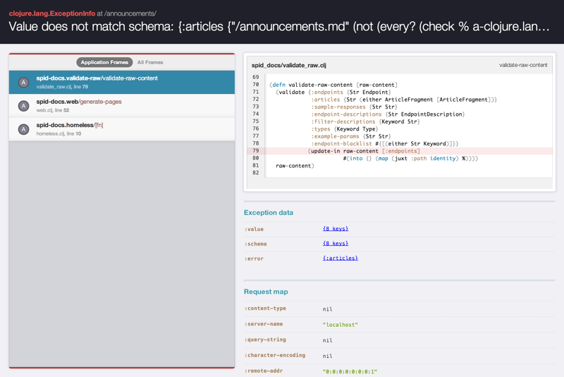

# prone [](http://travis-ci.org/magnars/prone)

Better exception reporting middleware for Ring. Heavily inspired by
[better_errors for Rails](https://github.com/charliesome/better_errors).

See it to believe it:
[a quick video demoing Prone](https://youtu.be/Fgv6bxmxxpM).

Prone presents your stack traces in a consumable form. It optionally filters out
stack frames that did not originate in your application, allowing you to focus
on your code. It allows you to browse environment data, such as the request map
and exception data (when using `ex-info`). Prone also provides a debug function
that enables you to visually browse local bindings and any piece of data you
pass to `debug`.



## Install

Add `[prone "2019-07-08"]` to `:dependencies` in your `project.clj`.

This project no longer uses Semantic Versioning. Instead we're aiming to never
break the API. Feel free to check out the [change log](#change-log).

## Usage

- **with lein-ring**

  Using `lein-ring` version `0.9.1` or above, add this to your `project.clj`:

  ```clj
  {:profiles {:dev {:ring {:stacktrace-middleware prone.middleware/wrap-exceptions}}}
  ```

- **without lein-ring**

  Add it as a middleware to your Ring stack:

  ```clj
  (ns example
    (:require [prone.middleware :as prone]))

  (def app
    (-> my-app
        prone/wrap-exceptions))
  ```
  
  Please note, with this configuration you should make sure to
  [only enable Prone in development](#should-i-use-prone-in-production).

- **with pedestal**

  See [prone-pedestal](https://github.com/eunmin/prone-pedestal)

- **with catacumba**

  See [catacumba-prone](https://github.com/funcool/catacumba-prone)

## Debugging

Whether you've tripped on an exception or not, you can use Prone to debug your
application:

```clj
(ns example
  (:require [prone.debug :refer [debug]]))

(defn myhandler [req]
  ;; ...
  (let [person (lookup-person (:id (:params req)))]
    (debug)))
```

Calling `debug` without any arguments like this will cause Prone to render the
exception page with information about your environment: the request map, and any
local bindings (`req` and `person` in the above example).

You can call `debug` multiple times. To differentiate calls, you can pass a
message as the first argument, but Prone will also indicate the source location
that triggered debugging.

`debug` accepts any number of forms to present in a value browser on the
error/debug page:

```clj
(debug) ;; Inspect locals
        ;; Halts the page if there are no exceptions

(debug "Here be trouble") ;; Same as above, with a message

(debug {:id 42}) ;; Inspect locals and the specific map
                 ;; Halts the page if there are no exceptions

(debug person project) ;; Same as above, with multiple values

(debug "What's this?" person project) ;; Same as above, with message
```

## Q & A

### Should I use Prone in production?

No. You would be exposing your innards to customers, and maybe even to someone with
nefarious purposes.

Here's one way to avoid it:

```clj
(def prone-enabled? (= "true" (System.getProperty "prone.enable")))

(def app
  (cond-> my-app
          prone-enabled? prone/wrap-exceptions))
```

You can chain more optional middlewares in this `cond->` too. Pretty nifty.

### How does Prone determine what parts of a stack trace belongs to the application?

By default it reads your `project.clj` and looks for namespaces starting with
the project name.

You can change this behavior by passing in some options to `wrap-exceptions`,
like so:

```clj
(-> app
    (prone/wrap-exceptions 
      {:app-namespaces ["our" "app" "namespace" "prefixes"]}))
```

All frames from namespaces prefixed with the names in the list will be marked as
application frames.

### How do I skip prone for certain requests?

Pass a predicate function `skip-prone?` to `wrap-exceptions`. For example, to
exclude Postman requests check for `postman-token` in the headers:

```clj
(-> app
    (prone/wrap-exceptions 
      {:skip-prone? (fn [req] (contains? (:headers req) "postman-token"))}))
```

### What about AJAX requests?

Yeah, that's a bit trickier. There's no point in serving a beautiful exception
page when you have to inspect it in devtools.

The prone response includes a `Link` header with a `rel=help` attribute. Like this:

```
Link:</prone/d97fa078-7638-4fd1-8e4a-9a22576a321f>; rel=help
```

Use this in your frontend code to display the page. Here's an example from one
of our sites:

```clj
(def rel-help-regex #"<(.+)>; rel=help")

(defn check-err [result]
  (if-let [url (->> (get-in result [:headers "link"] "")
                    (re-find rel-help-regex)
                    second)]
    (set! js/location url)
    (do (js/alert "fail")
        (prn result))))

(defn GET [url params]
  (go
    (let [result (<! (http/get url {:query-params params}))]
      (if (:success result)
        (do-some-successful-stuff)
        (check-err result)))))
```

#### A little trick

The latest prone error page can also be found under `/prone/latest`, so if you
haven't fixed your frontend code to use the `rel=help` header quite yet, you can
always go there to check it out.

### I'm getting double printing of error messages

Yeah, I guess you already have a logging framework to print errors for you? And
then prone goes and prints them as well. Turn it off like so:

```clj
(-> app
    (prone/wrap-exceptions 
      {:print-stacktraces? false}))
```

## Known problems

- We have not yet found a way to differentiate `some-name` and `some_name`
  function names by inspecting the stack trace. Currently, we assume kebab case.
- Using a middleware to always load the Austin `browser-connected-repl` for
  ClojureScript causes JavaScript errors that partly trips up Prone

## Change log

#### From 1.6.3 to 2019-07-08

- Add ability to copy values into clipboard
- Navigation now starts directly at the root cause exception
- Serialized values are now displayed better and more consistently
- Improved display of functions

#### From 1.6.1 to 1.6.3

- Can now navigate into sets + weeded out some weird set bugs
- Update realize, it now guards against infinite lazy seqs

#### From 1.6 to 1.6.1

- Don't crash without a project.clj-file.

#### From 1.5 to 1.6

- Support SQLException getNextException (timothypratley)
- Add column in addition to line number (timothypratley)
- Display `java.util.Date` like `#inst`

#### From 1.4 to 1.5

- Avoid expanding Datomic databases
- Don't show too many extra exceptions
- Always select the first source location when switching between exceptions

#### From 1.3 to 1.4

- Exceptions thrown when realizing lazy sequences are now handled properly.

#### From 1.2 to 1.3

- Add function to render self-contained page.

  This can be used to store prone-pages for later perusal even when the prone
  process is no longer running.

  ```
  (spit "my-error.html" (render-self-contained-page (create-exception-page e {})))
  ```

#### From 1.1 to 1.2

- Serve contents as UTF-8 - fixes occasional regexp error warning
- Upgrade Prism.JS - fixes graphical glitch with highlighted line
- Upgrade ClojureScript version - now supports namespaced keys.
- Show error page for assertion errors as well (alephyud)
- Fix error when showing maps with complex keys
- Fix compatibility Clojure 1.9 (lvh)
- Don't crash on invalid or missing line-numbers

#### From 1.0 to 1.1

- Added option `:print-stacktraces?` (Max Ovsiankin)
- Added latest prone error to `/prone/latest` (Daniel Lebrero)

## Contributors

- [Andrew Mcveigh](https://github.com/andrewmcveigh) added the `:app-namespaces` option.
- [Chris McDevitt](https://github.com/minimal) added the `:skip-prone?` option.
- [Malcolm Sparks](https://github.com/malcolmsparks) sorted map entries by keyword.
- [Ryo Fukumuro](https://github.com/rkworks) fixed several bugs.
- [Daniel Lebrero](https://github.com/dlebrero) added support for cljc files and `/prone/latest`.
- [Max Ovsiankin](https://github.com/gratimax) added the `:print-stacktraces?` option.
- [Timothy Pratley](https://github.com/timothypratley) added support for `SQLException getNextException`

Thanks!

## Contribute

Yes, please do. And add tests for your feature or fix, or we'll certainly break
it later.

#### Up and running

Prerequisites:

- NPM: https://www.npmjs.org/

To start the server:

- run `lein cljsbuild auto` in one terminal
- run `lein ring server-headless` in another.

`./bin/kaocha` will run all tests. (run `lein cljsbuild once` to generate
required js files)

To run tests continuously: `./bin/kaocha --watch`

After making changes to static files in `dev-resources`, run
`./build-js-sources.sh` again to update the concatenated files.

## License: BSD

Copyright © 2014-2018 Christian Johansen & Magnar Sveen. All rights reserved.

Redistribution and use in source and binary forms, with or without modification,
are permitted provided that the following conditions are met:

1. Redistributions of source code must retain the above copyright notice, this
list of conditions and the following disclaimer.

2. Redistributions in binary form must reproduce the above copyright notice,
this list of conditions and the following disclaimer in the documentation and/or
other materials provided with the distribution.

3. Neither the name of the copyright holder nor the names of its contributors
may be used to endorse or promote products derived from this software without
specific prior written permission.

THIS SOFTWARE IS PROVIDED BY THE COPYRIGHT HOLDERS AND CONTRIBUTORS "AS IS" AND
ANY EXPRESS OR IMPLIED WARRANTIES, INCLUDING, BUT NOT LIMITED TO, THE IMPLIED
WARRANTIES OF MERCHANTABILITY AND FITNESS FOR A PARTICULAR PURPOSE ARE
DISCLAIMED. IN NO EVENT SHALL THE COPYRIGHT HOLDER OR CONTRIBUTORS BE LIABLE FOR
ANY DIRECT, INDIRECT, INCIDENTAL, SPECIAL, EXEMPLARY, OR CONSEQUENTIAL DAMAGES
(INCLUDING, BUT NOT LIMITED TO, PROCUREMENT OF SUBSTITUTE GOODS OR SERVICES;
LOSS OF USE, DATA, OR PROFITS; OR BUSINESS INTERRUPTION) HOWEVER CAUSED AND ON
ANY THEORY OF LIABILITY, WHETHER IN CONTRACT, STRICT LIABILITY, OR TORT
(INCLUDING NEGLIGENCE OR OTHERWISE) ARISING IN ANY WAY OUT OF THE USE OF THIS
SOFTWARE, EVEN IF ADVISED OF THE POSSIBILITY OF SUCH DAMAGE.
